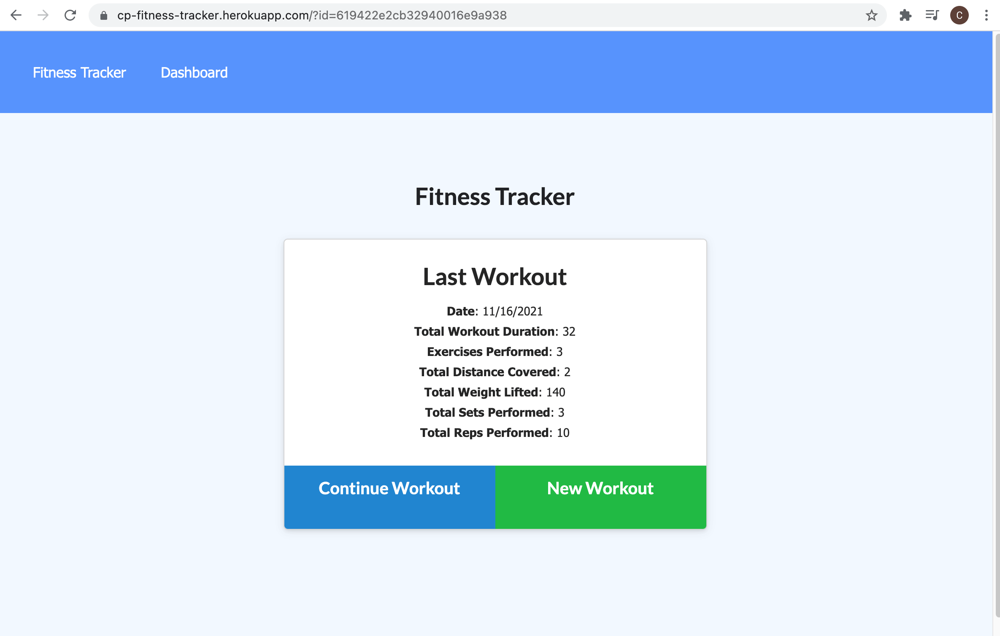

# fitness-tracker

## Description ##

Link to deployed app: <https://cp-fitness-tracker.herokuapp.com/>

This application allows a user to keep track of individual workouts and exercises, and see a summary of last 7 days. It is based on nodejs and mongoDb with express, mongoose packages. 

High Level User Story:
As a USER I want to be able to create, view and track daily workouts
As a USER I want to be able to add multiple exercises and workouts in a day
As a USER I can track exercise type, duration, reps, sets, weights, distance
As a USER I can see a summary of stats for last 7 workouts

Note: this application is covered by the  license

## Table of Contents ##

* [Installation](#installation)
* [Usage](#usage)
* [License](#license)
* [Contributing](#contributing)
* [Tests](#tests)¬¬
* [Questions](#questions)

- - -

## Installation ##
Below are brief instructions on how to install:

You will need node.js with the express and mongoose packages. You can download the basic files from the repo. 

In addition, this relies on a MongoDb backend. I have used a shared Atlas DB running in AWS. If you want to set up your own MongoDb you will need to create an instance and add the connection information to the server.js file. You will also need to create a .env file with the connection string to the MONGODB_URI.

## Usage ##
How to use this application: 

Once you have cloned the repo and set up node and the dependencies, you can run from the terminal using bash or zsh on mac. 

## License ##
This application is covered by the following license: 

Creative Commons license family 4.0

## Contributing ##
This project was developed by Chris Pysden as part of the UW Bootcamp Certificate Course for Full Stack Developers. If you would like to contribute to improving this project, then you'd be very welcome. Please follow the following guidelines (which are loosely based on Atom project guidelines):

* send an email to me using the links below to request to be added to the project and improvements briefly describe the improvements you'd like to make
* always create a new branch that encapsulates your changes
* notifiy me before commiting any updates/changes
* track all bugs as issues in the project
* have fun

## Tests ##
Tests included are referenced below:

Test:  

I am working on implementing some basic tests to check validity of the input and to ensure consistency. Currently there are no tests that ship with the code.

## Questions ##

My Github profile is here: <https://github.com/cpysden-coder>

Please contact me with questions at <chris_pysden@mac.com>

